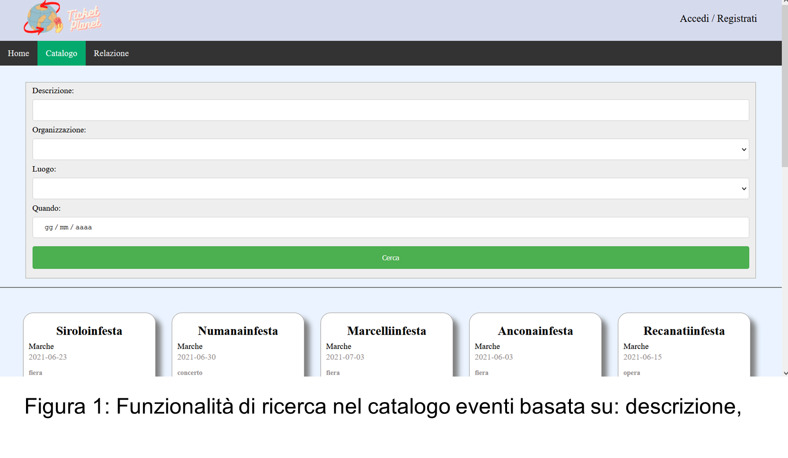

# Event Booking Website (made with Laravel framework)
The project aims to create a website for the promotion and commercialization of events organized in Italy.
It was developed for the Web Technologies exam at Università Politecnica delle Marche.

Made by Matteo Giri, Lorenzo Tiseni, Edoardo Bilancia, Andrea Camilloni.

Read the full report [here](<Relazione tWeb.docx>) (in Italian).
